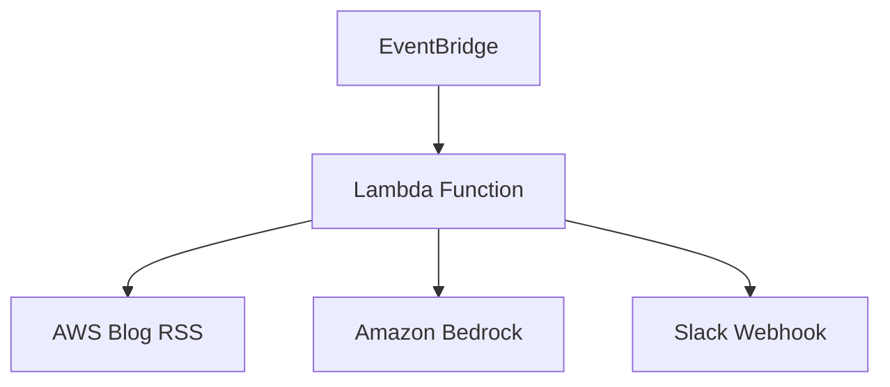

# AWS News Feeder

AWSブログの新着記事を監視し、要約してSlackに投稿するシステム

## 機能
- AWSブログのRSSフィードを定期的に監視
- 新着記事の内容を取得し、要約を生成（Amazon Bedrock使用）
- 指定したSlackチャンネルに投稿

## システム構成


## 使用技術
- AWS Lambda (定期実行)
- AWS EventBridge (スケジューリング)
- Amazon Bedrock (記事要約)
- Python
  - feedparser (RSSパース)
  - boto3 (AWS API)
  - requests (Slack投稿)

## ローカル環境のセットアップ
1. リポジトリのクローン
```bash
git clone [repository-url]
cd aws-news-feeder
```

2. 環境構築の実行
```bash
./setup.sh
```
これにより以下が実行されます：
- Python仮想環境の作成（.venv）
- 必要なパッケージのインストール
- .envファイルの作成

3. 環境変数の設定
```bash
# .envファイルを編集
vim .env
```
必要な環境変数：
- SLACK_WEBHOOK_URL: Slackのwebhook URL
- AWS_BLOG_RSS_URL: AWS BlogのRSS URL（デフォルト: https://aws.amazon.com/blogs/aws/feed/）
- AWS認証情報（ローカルテスト用）
  - AWS_ACCESS_KEY_ID
  - AWS_SECRET_ACCESS_KEY
  - AWS_DEFAULT_REGION

4. 仮想環境の有効化
```bash
source .venv/bin/activate
```

## デプロイ手順
1. デプロイパッケージの作成
```bash
./deploy.sh
```

2. AWS Lambdaへのデプロイ
- AWSマネジメントコンソールにログイン
- Lambda関数を作成
  - 関数名: aws-news-feeder
  - ランタイム: Python 3.11
  - アーキテクチャ: x86_64

3. Lambda環境変数の設定
   - Lambda > 関数 > aws-news-feeder > 設定 > 環境変数
   - 以下の環境変数を設定：
     - SLACK_WEBHOOK_URL: Slack Incoming Webhookのエンドポイント
     - AWS_BLOG_RSS_URL: AWS BlogのRSS URL（オプション）

4. IAM実行ロールの設定
   - Amazon Bedrockへのアクセス権限を追加
   - タイムアウトを5分に設定

5. EventBridgeでスケジュール実行を設定
   - ルール名: aws-news-feeder-scheduler
   - スケジュール式: cron(0 3 * * ? *)  # 毎日JST 12:00（UTC 03:00）に実行
